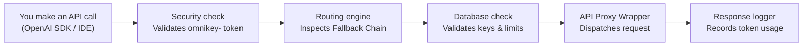

# OmniKey AI: Unified Key Manager — User Guide

> **OmniKey AI** is an AI-powered API proxy and gateway that lives locally on your machine and serves as a single endpoints hub for twelve free-tier LLM providers. Once running, you point your OpenAI-compatible SDKs or developer IDEs (like Cursor or Continue.dev) to it using a single unified `omnikey-` key. It handles AES-256-GCM encrypted key storage, token limits tracking, rate-limiting retries, and automatic provider fallbacks fully transparently on-device.

---

## Table of Contents

1. [How It Works — The Big Picture](#how-it-works--the-big-picture)
2. [Application Walkthrough](#application-walkthrough)
3. [Full Pathway #1 — Routing Request](#full-pathway-1--routing-request)
4. [Full Pathway #2 — Fallback Cascade](#full-pathway-2--fallback-cascade)
5. [Full Pathway #3 — Virtual Model Query](#full-pathway-3--virtual-model-query)
6. [Example 1 — Querying Google Gemini](#example-1--querying-google-gemini)
7. [Example 2 — Querying Groq](#example-2--querying-groq)
8. [Example 3 — Querying SambaNova](#example-3--querying-sambanova)
9. [Example 4 — Fallback Chain Setup](#example-4--fallback-chain-setup)
10. [Example 5 — Virtual Auto Model](#example-5--virtual-auto-model)
11. [Example 6 — Checking Stats & Key Limits](#example-6--checking-stats--key-limits)
12. [Smart Routing — How OmniKey AI Handles Limits](#smart-routing--how-omnikey-ai-handles-limits)
13. [UI Guide — Dashboard & Models](#ui-guide--dashboard--models)
14. [UI Guide — Debate Arena](#ui-guide--debate-arena)
15. [UI Guide — Keys & Encryption](#ui-guide--keys--encryption)
16. [Database Schema](#database-schema)
17. [Provider Adaptors](#provider-adaptors)
18. [Troubleshooting](#troubleshooting)
19. [Project Summary](#project-summary)

---

## How It Works — The Big Picture



<details>
<summary>ASCII fallback (click to expand)</summary>

```
┌────────────────┐     ┌──────────────┐     ┌────────────────┐     ┌──────────────┐     ┌────────────────┐
│  API Call from  │────►│  Security    │────►│  Routing       │────►│  DB Check    │────►│  Proxy Wrapper │
│  OpenAI Client │     │  Validation  │     │  Engine        │     │  API Keys &  │     │  Dispatches to │
│  (Bearer)      │     │  AES-256-GCM │     │  Fallback order│     │  Quota status│     │  upstream LLM  │
└────────────────┘     └──────────────┘     └────────────────┘     └──────────────┘     └──────┬─────────┘
                                                                                               │
                                                                           ┌────────────────┐  │
                                                                           │ Response       │◄─┘
                                                                           │ Logger logs    │
                                                                           │ usage details  │
                                                                           └────────────────┘
```

</details>

**In plain English:**

1. **You make an API call** — Using standard OpenAI-compatible libraries pointing to `http://localhost:3001/v1/chat/completions`.
2. **Security check validates token** — Evaluates if the client request contains a valid bearer token matching the database's `omnikey-` master key.
3. **Routing engine identifies the provider** — Decides which platform to hit based on your custom Fallback Chain ordering and target model support.
4. **Key and quota verification** — Retrieves the AES-256-GCM encrypted API key from the database and checks that it hasn't exceeded daily/monthly token limits.
5. **Upstream dispatch** — Wraps payloads into the specific format needed by Gemini, Groq, Cerebras, etc., and issues the request.
6. **Token logger updates stats** — On response success, parses the completion usage metrics and writes them to the database to ensure budget safety.

---

## Application Walkthrough

### Starting OmniKey AI

1. **Loads environment configuration**: Reads ports and `ENCRYPTION_KEY` from the `.env` file.
2. **Database Initialization**: Connects to `server/data/OmniKeyAI.db`. Creates schema tables and seeds default models/fallbacks if it's a fresh setup.
3. **Starts Proxy Listener**: Binds Express to the configured port (default `3001`).
4. **Starts React Client**: In development mode, Vite fires the UI on port `5173`. In production mode, Express serves the built client bundle.

---

## Full Pathway #1 — Routing Request

### Step 1: Client Request Dispatched
An LLM query is issued to `http://localhost:3001/v1/chat/completions` with the model parameter set to `"gemini-2.5-flash"`.

### Step 2: Authentication
The security middleware extracts the Authorization header: `Bearer omnikey-1aed444...`. It queries the local SQLite database to verify the unified key.

### Step 3: Adapter Resolution
The Routing Engine scans the active catalog for models matching `gemini-2.5-flash`. It discovers `google` is the registered provider.

### Step 4: Key Retrieval
The database manager pulls the Google Gemini API key:
- Reads encrypted key from database.
- Decrypts it using the local `ENCRYPTION_KEY` via AES-256-GCM.

### Step 5: Provider Query
The request payload is transformed into Google's Gemini API format. The proxy calls the upstream Google API endpoint.

### Step 6: Response Parsing & Logging
The success payload is mapped back to the OpenAI-spec chat completions response shape. The token counters are incremented in the `daily_usage` table before the response is returned to the client.

---

## Full Pathway #2 — Fallback Cascade

### Step 1: Upstream Rate Limit
A request targeting `"llama3-70b"` is sent. The highest-priority provider for this model is Groq.

### Step 2: Primary Request Failure
Groq returns a `429 Too Many Requests` response (indicating token limit reached).

### Step 3: Escalation
The routing engine interceptor catches the 429 response. It marks the active Groq key as temporarily rate-limited.

### Step 4: Next-Best Choice
The router scans the fallback chain configuration. SambaNova is listed as the next best provider supporting a compatible Llama-3-70b equivalent model.

### Step 5: Fallback Dispatch
The request is dynamically re-routed to SambaNova using the SambaNova API key.

### Step 6: Success
SambaNova returns `200 OK`. The client receives the response text seamlessly. The client application never realized a failover event occurred.

---

## Full Pathway #3 — Virtual Model Query

### Step 1: Client requests "auto"
A client sends a request without specifying a model name, setting `model: "auto"`.

### Step 2: Priority Selection
The router reads the user's fallback chain from the database. The top provider in the list is Gemini.

### Step 3: Best Model Map
The router looks up the default fallback model configuration for Gemini (e.g. `gemini-2.5-flash`).

### Step 4: Execution
The request is routed to Gemini using the default model.

---

## Full Pathway #4 — Gemini Ingress API Request

### Step 1: Gemini Request Dispatched
A query is sent to `http://localhost:3001/v1beta/models/gemini-2.5-flash:generateContent?key=omnikey-g-12345...`.

### Step 2: Query Parameter Authentication
The Gemini proxy middleware extracts the `key` query parameter (`omnikey-g-12345...`) and verifies it against the configured database session context.

### Step 3: Payload Translation (Ingress)
The middleware takes the Gemini request schema (`contents`, `systemInstruction`, `generationConfig`) and maps it into a normalized array of `ChatMessage` objects.

### Step 4: Routing & Execution
The proxy selects the target model config (`gemini-2.5-flash`), verifies token limits, decrypts the Google API key, and calls the Google API.

### Step 5: Response Translation (Egress)
The Google API return payload is translated back into the standard Gemini response JSON candidate layout (matching the schema the Gemini SDK expects) and returned to the client. Token counts are parsed and saved to the database.

---

## Example 1 — Querying Google Gemini

**API Target:** `gemini-2.5-flash` or `gemini-2.5-pro`

```json
{
  "model": "gemini-2.5-flash",
  "messages": [{"role": "user", "content": "Hello!"}]
}
```

Google Gemini's adapter structures messages to match their custom blocks array, queries their servers, and translates the response back to OpenAI's schema.

---

## Example 2 — Querying Groq

**API Target:** `llama-3.3-70b-versatile` or `qwen-2.5-32b`

Groq provides extremely fast Llama and Qwen models. When query limits are reached, the router cascades requests down to SambaNova or OpenRouter.

---

## Example 3 — Querying SambaNova

**API Target:** `deepseek-r1` or `llama-3.1-405b`

SambaNova is highly effective for running DeepSeek and Qwen models. OmniKey AI interfaces with it seamlessly.

---

## Example 4 — Fallback Chain Setup

Through the React Dashboard settings page, you can reorder the priority of your providers. 

```
Fallback Chain:
1. Google (Gemini)
2. Groq
3. Cerebras
4. SambaNova
5. OpenRouter
```

If Google is at the top of the chain, all `auto` requests try Google first, falling back to Groq if Google rate limits.

---

## Example 5 — Virtual Auto Model

The virtual model `"auto"` acts as a dynamic target. Instead of changing models in your application config, you change the fallback order inside OmniKey AI to immediately swap underlying models.

---

## Example 6 — Checking Stats & Key Limits

Each time an API call completes:
1. `completion_tokens` and `prompt_tokens` are recorded.
2. The `daily_usage` table is updated.
3. If usage reaches the provider's free-tier token cap, the provider status is set to `exhausted` for the day.

---

## Smart Routing — How OmniKey AI Handles Limits

To prevent API keys from getting banned or throwing persistent rate limit errors, OmniKey AI applies:
* **Token Budget Checks**: Before executing, checking if the current day's token consumption exceeds limits.
* **429 Interception**: Catching rate limit headers from upstream responses and dynamically switching providers.
* **Cooldown Windows**: Putting a rate-limited key on a temporary cooldown before retrying.

---

## UI Guide — Dashboard & Models

The React client dashboard has a responsive visual layout:
* **Models Page**: Complete interactive page featuring columns configuration, name search, sorting, total model counts, and availability check indicators.
* **Health Check Status**: Dials showing API latency, key states, and exact execution timing timestamps.
* **Budget Tracking Bars**: Live progress indicators of token quotas.
* **Playground**: Integrated API Format toggle allowing testing using either standard OpenAI format or Gemini JSON format in real-time, with interactive browser-based Voice recording and modality selection.
* **Developer Corner**: Sandboxed terminal featuring format toggling, Voice (speech input/transcription) console sandbox, auto-compiling JS client code snippet templates for both OpenAI and Gemini, and rendering stream console blocks.
* **Debate Arena**: Configurable page to stage multi-round debates between two model personas under a Judge model, featuring status prompts and history sanitization.
* **Responsive Theme Switcher**: Toggle persistently between light and dark modes from the page header.
* **Switch to Local**: A shortcut button next to the database status label to instantly toggle between local database mode and cloud mode.

---

## UI Guide — Debate Arena

The **AI Debate Arena** is an advanced orchestration sandbox designed to pits two separate models against each other.

### 1. Setup Panel
* **Topic Input:** Describe the topic of discussion.
* **In Favor / Against / Judge Models:** Select active catalog models to fill the agent roles.
* **Number of Turns:** Configure the length of the debate.
* **Opening Player:** Select who goes first.
* **Judging Interval:** Choose between judging incrementally at the end of each round, or a final cumulative verdict at the end.

### 2. Sandbox Floor
* Messages are rendered in user-friendly blocks colored by role (Green for In Favor, Red for Against, Amber/Gold for Judge critiques).
* Detailed real-time status and telemetry logs show latency and routed key tags.
* Flawless backend compatibility handles message sanitization automatically.

---

## UI Guide — Admin Console (`/admin`)

The Administrative interface can be reached by appending `/admin` to your dashboard port. It allows operators to monitor, manage, and configure server infrastructure:
* **Dashboard Tab**:
  - Displays high-level KPIs: Total Users, API Keys (active count), Overall Savings (formatted in Rupees `₹` at 83 INR/USD), and Avg Saved per request (INR `₹`).
  - Request volume charts and latency distribution percentages (Fast, Normal, Slow, Very Slow).
  - Top 5 error breakdown tracking for debug visibility.
* **Models Tab**: Allows admins to enable/disable specific model definitions globally across all providers.
* **Logs Tab**: Shows the 15 most recent proxy request logs, mapping client UIDs to their registered **Developer Emails** for audit clarity. Features a "Flush Audit Logs" button.
* **Security Tab**: Rotate administrative access credentials (username and password). New passwords are automatically hashed with HMAC-SHA256 using a deterministic salt before persistence.

---

## UI Guide — Keys & Encryption

* **Master Key Generation**: The server displays both your master unified OpenAI `omnikey-...` key and unified Gemini `omnikey-g-...` key on the keys page.
* **Upstream Protection**: Stored keys are checked against duplication before additions or CSV uploads are accepted.
* **AES-256-GCM Storage**: When you input a key, it is encrypted symmetrically with your `ENCRYPTION_KEY` using a unique initialization vector.
* **Database Mode Selection**: Toggle between Local-First SQLite Mode and Cloud MongoDB Atlas Mode directly from the client interface (saved persistently in browser local storage). Persistent fallback credentials (`admin` / `admin`) auto-seed MongoDB collections or local database setups on startup.

---

## Database Schema & Multitenancy

OmniKey AI operates with two database adapter contexts dynamically toggled on a per-request basis via `AsyncLocalStorage` middleware checking client headers:

### 1. Local SQLite Context (Single User Mode)
- `api_keys`: Stored credentials, decryption salts, and provider labels.
- `fallback_config`: Priority ranking maps.
- `catalog`: Provider model target directory.
- `usage_logs`: Token totals, request logs, and latency stats.
- `system_settings`: Master OpenAI unified key and Gemini unified key.

### 2. Cloud MongoDB Context (Multi-Tenant Mode)
- Uses mongoose schemas to support concurrent multi-client sessions.
- `UserSettings` schema contains `unifiedApiKey` and `unifiedGeminiApiKey` parameters.
- Multi-tenant API token patterns starting with `omnikey-` will automatically authenticate and query collections against MongoDB.

---

## Provider Adaptors

Adapters normalize distinct APIs into a single standard:
* **OpenAI-Compat Adaptors**: Wraps Groq, Cerebras, SambaNova, Cohere, Mistral, GitHub Models.
* **Custom REST Adaptors**: Integrates Google (Gemini), Cloudflare, and Z.ai.

---

## Troubleshooting & Utilities

### Keep-Alive Cron Pinger
* **Symptom**: Cloud platform hosts (like Render) sleep after inactive periods.
* **Solution**: Enable a cron ping target against `/api/cron-health` to receive uptime stats every 2 minutes.

### Decryption Failures
* **Symptom**: Server console outputs `Decryption failed` errors.
* **Solution**: Ensure your `ENCRYPTION_KEY` in `.env` matches the key used when the database credentials were added.

### Port Conflicts
* **Symptom**: `EADDRINUSE: address already in use :::3001`
* **Solution**: Change `PORT` in `.env` to an open port (e.g., `PORT=3500`).

---

## Project Summary

### Tech Stack
* **Runtime**: Node.js (v20+)
* **Server Framework**: Express with TypeScript
* **State Managers**: Node `AsyncLocalStorage` for concurrent database tenancy
* **Database Engine**: SQLite3 & MongoDB Atlas (Mongoose)
* **Dashboard Client**: React, Vite, Tailwind CSS, Shadcn-inspired UI

---

<p align="center">
  <sub>Built for developers who want a single, smart API key for a billion free LLM tokens.</sub>
</p>
