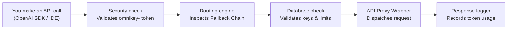

# OmniKey AI: Unified Key Manager — User Guide

> **OmniKey AI** is an AI-powered API proxy and gateway that lives locally on your machine and serves as a single endpoints hub for twelve free-tier LLM providers. Once running, you point your OpenAI-compatible SDKs or developer IDEs (like Cursor or Continue.dev) to it using a single unified `omnikey-` key. It handles AES-256-GCM encrypted key storage, token limits tracking, rate-limiting retries, and automatic provider fallbacks fully transparently on-device.

---

## Table of Contents

1. [How It Works — The Big Picture](#how-it-works--the-big-picture)
2. [Application Walkthrough](#application-walkthrough)
3. [Full Pathway #1 — Routing Request](#full-pathway-1--routing-request)
4. [Full Pathway #2 — Fallback Cascade](#full-pathway-2--fallback-cascade)
5. [Full Pathway #3 — Virtual Model Query](#full-pathway-3--virtual-model-query)
6. [Example 1 — Querying Google Gemini](#example-1--querying-google-gemini)
7. [Example 2 — Querying Groq](#example-2--querying-groq)
8. [Example 3 — Querying SambaNova](#example-3--querying-sambanova)
9. [Example 4 — Fallback Chain Setup](#example-4--fallback-chain-setup)
10. [Example 5 — Virtual Auto Model](#example-5--virtual-auto-model)
11. [Example 6 — Checking Stats & Key Limits](#example-6--checking-stats--key-limits)
12. [Smart Routing — How OmniKey AI Handles Limits](#smart-routing--how-omnikey-ai-handles-limits)
13. [UI Guide — Dashboard & Models](#ui-guide--dashboard--models)
14. [UI Guide — Keys & Encryption](#ui-guide--keys--encryption)
15. [Database Schema](#database-schema)
16. [Provider Adaptors](#provider-adaptors)
17. [Troubleshooting](#troubleshooting)
18. [Project Summary](#project-summary)

---

## How It Works — The Big Picture



<details>
<summary>ASCII fallback (click to expand)</summary>

```
┌────────────────┐     ┌──────────────┐     ┌────────────────┐     ┌──────────────┐     ┌────────────────┐
│  API Call from  │────►│  Security    │────►│  Routing       │────►│  DB Check    │────►│  Proxy Wrapper │
│  OpenAI Client │     │  Validation  │     │  Engine        │     │  API Keys &  │     │  Dispatches to │
│  (Bearer)      │     │  AES-256-GCM │     │  Fallback order│     │  Quota status│     │  upstream LLM  │
└────────────────┘     └──────────────┘     └────────────────┘     └──────────────┘     └──────┬─────────┘
                                                                                               │
                                                                           ┌────────────────┐  │
                                                                           │ Response       │◄─┘
                                                                           │ Logger logs    │
                                                                           │ usage details  │
                                                                           └────────────────┘
```

</details>

**In plain English:**

1. **You make an API call** — Using standard OpenAI-compatible libraries pointing to `http://localhost:3001/v1/chat/completions`.
2. **Security check validates token** — Evaluates if the client request contains a valid bearer token matching the database's `omnikey-` master key.
3. **Routing engine identifies the provider** — Decides which platform to hit based on your custom Fallback Chain ordering and target model support.
4. **Key and quota verification** — Retrieves the AES-256-GCM encrypted API key from the database and checks that it hasn't exceeded daily/monthly token limits.
5. **Upstream dispatch** — Wraps payloads into the specific format needed by Gemini, Groq, Cerebras, etc., and issues the request.
6. **Token logger updates stats** — On response success, parses the completion usage metrics and writes them to the database to ensure budget safety.

---

## Application Walkthrough

### Starting OmniKey AI

1. **Loads environment configuration**: Reads ports and `ENCRYPTION_KEY` from the `.env` file.
2. **Database Initialization**: Connects to `server/data/freeapi.db`. Creates schema tables and seeds default models/fallbacks if it's a fresh setup.
3. **Starts Proxy Listener**: Binds Express to the configured port (default `3001`).
4. **Starts React Client**: In development mode, Vite fires the UI on port `5173`. In production mode, Express serves the built client bundle.

---

## Full Pathway #1 — Routing Request

### Step 1: Client Request Dispatched
An LLM query is issued to `http://localhost:3001/v1/chat/completions` with the model parameter set to `"gemini-2.5-flash"`.

### Step 2: Authentication
The security middleware extracts the Authorization header: `Bearer omnikey-1aed444...`. It queries the local SQLite database to verify the unified key.

### Step 3: Adapter Resolution
The Routing Engine scans the active catalog for models matching `gemini-2.5-flash`. It discovers `google` is the registered provider.

### Step 4: Key Retrieval
The database manager pulls the Google Gemini API key:
- Reads encrypted key from database.
- Decrypts it using the local `ENCRYPTION_KEY` via AES-256-GCM.

### Step 5: Provider Query
The request payload is transformed into Google's Gemini API format. The proxy calls the upstream Google API endpoint.

### Step 6: Response Parsing & Logging
The success payload is mapped back to the OpenAI-spec chat completions response shape. The token counters are incremented in the `daily_usage` table before the response is returned to the client.

---

## Full Pathway #2 — Fallback Cascade

### Step 1: Upstream Rate Limit
A request targeting `"llama3-70b"` is sent. The highest-priority provider for this model is Groq.

### Step 2: Primary Request Failure
Groq returns a `429 Too Many Requests` response (indicating token limit reached).

### Step 3: Escalation
The routing engine interceptor catches the 429 response. It marks the active Groq key as temporarily rate-limited.

### Step 4: Next-Best Choice
The router scans the fallback chain configuration. SambaNova is listed as the next best provider supporting a compatible Llama-3-70b equivalent model.

### Step 5: Fallback Dispatch
The request is dynamically re-routed to SambaNova using the SambaNova API key.

### Step 6: Success
SambaNova returns `200 OK`. The client receives the response text seamlessly. The client application never realized a failover event occurred.

---

## Full Pathway #3 — Virtual Model Query

### Step 1: Client requests "auto"
A client sends a request without specifying a model name, setting `model: "auto"`.

### Step 2: Priority Selection
The router reads the user's fallback chain from the database. The top provider in the list is Gemini.

### Step 3: Best Model Map
The router looks up the default fallback model configuration for Gemini (e.g. `gemini-2.5-flash`).

### Step 4: Execution
The request is routed to Gemini using the default model.

---

## Example 1 — Querying Google Gemini

**API Target:** `gemini-2.5-flash` or `gemini-2.5-pro`

```json
{
  "model": "gemini-2.5-flash",
  "messages": [{"role": "user", "content": "Hello!"}]
}
```

Google Gemini's adapter structures messages to match their custom blocks array, queries their servers, and translates the response back to OpenAI's schema.

---

## Example 2 — Querying Groq

**API Target:** `llama-3.3-70b-versatile` or `qwen-2.5-32b`

Groq provides extremely fast Llama and Qwen models. When query limits are reached, the router cascades requests down to SambaNova or OpenRouter.

---

## Example 3 — Querying SambaNova

**API Target:** `deepseek-r1` or `llama-3.1-405b`

SambaNova is highly effective for running DeepSeek and Qwen models. OmniKey AI interfaces with it seamlessly.

---

## Example 4 — Fallback Chain Setup

Through the React Dashboard settings page, you can reorder the priority of your providers. 

```
Fallback Chain:
1. Google (Gemini)
2. Groq
3. Cerebras
4. SambaNova
5. OpenRouter
```

If Google is at the top of the chain, all `auto` requests try Google first, falling back to Groq if Google rate limits.

---

## Example 5 — Virtual Auto Model

The virtual model `"auto"` acts as a dynamic target. Instead of changing models in your application config, you change the fallback order inside OmniKey AI to immediately swap underlying models.

---

## Example 6 — Checking Stats & Key Limits

Each time an API call completes:
1. `completion_tokens` and `prompt_tokens` are recorded.
2. The `daily_usage` table is updated.
3. If usage reaches the provider's free-tier token cap, the provider status is set to `exhausted` for the day.

---

## Smart Routing — How OmniKey AI Handles Limits

To prevent API keys from getting banned or throwing persistent rate limit errors, OmniKey AI applies:
* **Token Budget Checks**: Before executing, checking if the current day's token consumption exceeds limits.
* **429 Interception**: Catching rate limit headers from upstream responses and dynamically switching providers.
* **Cooldown Windows**: Putting a rate-limited key on a temporary cooldown before retrying.

---

## UI Guide — Dashboard & Models

The React client dashboard has a responsive visual layout:
* **Models Catalog**: Lists all 60+ supported models across 12 platforms.
* **Health Check status**: Dials showing API latency and key states.
* **Budget Tracking bars**: Live progress indicators of token quotas.

---

## UI Guide — Keys & Encryption

* **Master Key Generation**: The server displays your master unified `omnikey-...` API key on startup.
* **AES-256-GCM Storage**: When you input a key, it is encrypted symmetrically with your `ENCRYPTION_KEY` using a unique initialization vector.

---

## Database Schema

OmniKey AI uses SQLite with 4 core tables:
* `api_keys`: Encrypted key payloads, status, and provider labels.
* `fallback_config`: Fallback chain ranking and priority order.
* `catalog`: Complete model list with provider mappings.
* `usage_logs`: Historic transaction logs, token counts, and latency metrics.

---

## Provider Adaptors

Adapters normalize distinct APIs into a single standard:
* **OpenAI-Compat Adaptors**: Wraps Groq, Cerebras, SambaNova, Cohere, Mistral, GitHub Models.
* **Custom REST Adaptors**: Integrates Google (Gemini), Cloudflare, and Z.ai.

---

## Troubleshooting

### Decryption Failures
* **Symptom**: Server console outputs `Decryption failed` errors.
* **Solution**: Ensure your `ENCRYPTION_KEY` in `.env` matches the key used when the database credentials were added.

### Port Conflicts
* **Symptom**: `EADDRINUSE: address already in use :::3001`
* **Solution**: Change `PORT` in `.env` to an open port (e.g., `PORT=3500`).

---

## Project Summary

### Tech Stack
* **Runtime**: Node.js (v20+)
* **Server Framework**: Express with TypeScript
* **Database**: SQLite3
* **Dashboard client**: React, Vite, Tailwind CSS

---

<p align="center">
  <sub>Built for developers who want a single, smart API key for a billion free LLM tokens.</sub>
</p>
