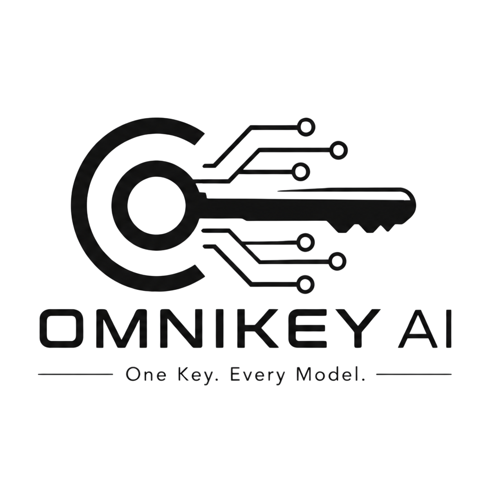
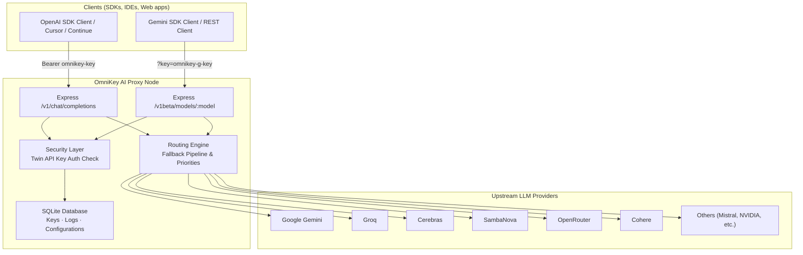
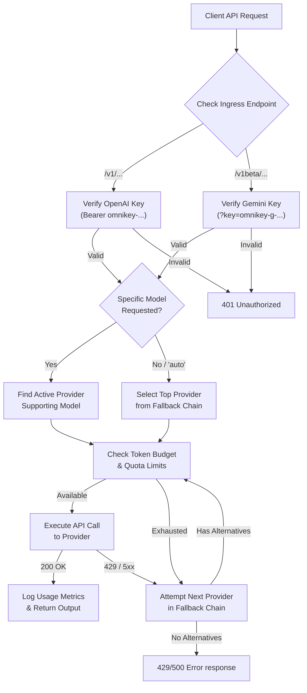
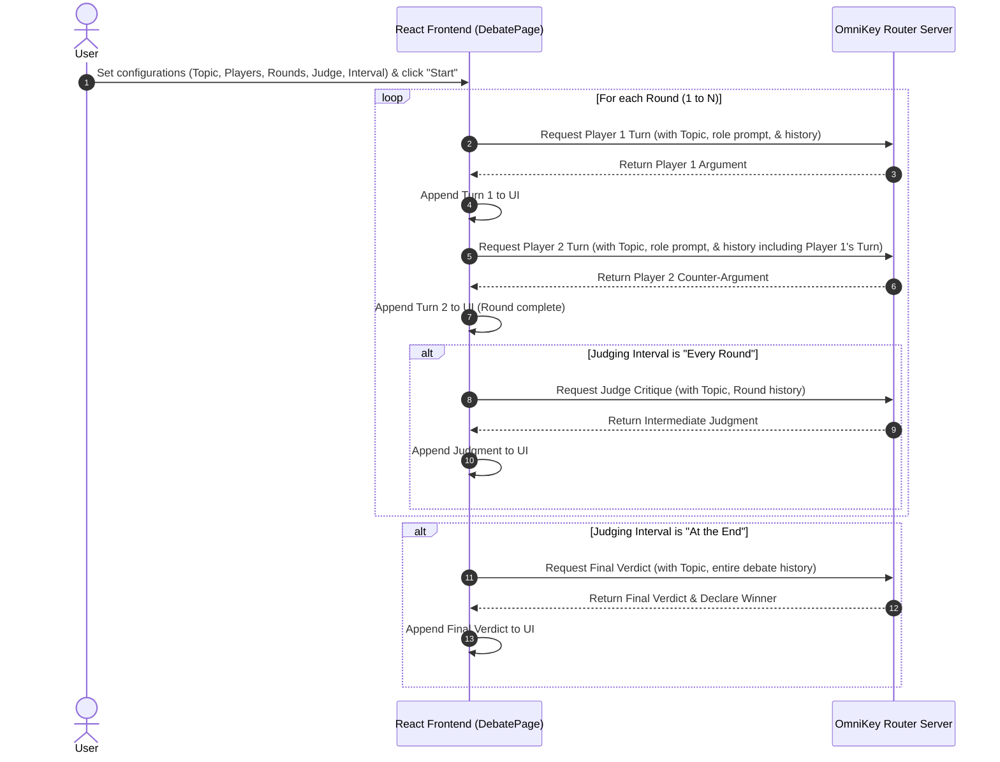

<p align="center">
  <picture>
    <source media="(prefers-color-scheme: dark)" srcset="assets/logo-dark-theme.png">
    
  </picture>
</p>
<h1 align="center">OmniKey AI: Unified Key Manager</h1>
<p align="center">
  <strong>Unified OpenAI-compatible and Gemini-compatible endpoints. Twelve free LLM providers. ~1B+ tokens per month.</strong><br/>
  <em>One bearer token → speak to 60+ models offline or online — OmniKey AI routes, falls over, and tracks budget transparently</em>
</p>

<p align="center">
  
  
  
  
  
  
</p>

---

## Table of Contents

- [Overview](#overview)
- [Why OmniKey AI?](#why-omnikey-ai)
- [Features](#features)
- [System Architecture](#system-architecture)
- [Pipeline Flow](#pipeline-flow)
- [Dynamic Routing and Fallbacks](#dynamic-routing-and-fallbacks)
- [Smart Routing and Limits](#smart-routing-and-limits)
- [User Interface Guides](#user-interface-guides)
  - [Dashboard and Models](#dashboard-and-models)
  - [Debate Arena](#debate-arena)
  - [Admin Console](#admin-console)
  - [Keys and Encryption](#keys-and-encryption)
- [Quick Start](#quick-start)
- [Project Structure](#project-structure)
- [Key Components](#key-components)
- [Dependencies](#dependencies)
- [Configuration](#configuration)
- [Database Schema and Multitenancy](#database-schema-and-multitenancy)
- [Upstream Provider Adapters](#upstream-provider-adapters)
- [Troubleshooting](#troubleshooting)
- [Roadmap](#roadmap)
- [License](#license)
- [Author](#author)

---

## Overview

**OmniKey AI** is a self-hosted, multi-format API gateway proxy that wraps 12 free-tier LLM providers—Gemini, OpenRouter, Cerebras, Groq, Mistral, GitHub Models, SambaNova, Cohere, Cloudflare, Z.ai (Zhipu), HuggingFace, and NVIDIA—into a unified environment. 

The proxy serves two endpoints natively:
* **OpenAI-Compatible Endpoint (`/v1`)**: Point OpenAI SDKs or clients at `/v1/chat/completions` using your unified OpenAI key (`omnikey-` prefix). Supports standard chat, vision, transcription (Voice STT), and text-to-speech (Voice TTS).
* **Gemini-Compatible Endpoint (`/v1beta`)**: Point Gemini SDKs or REST clients at `/v1beta/models/:model` (supporting `generateContent` and `streamGenerateContent` methods) using your unified Gemini key (`omnikey-g-` prefix). Supports multimodal inputs including text, images (Vision), and voice (Speech Input & Response Generation).

Behind the scenes, OmniKey AI handles key storage (encrypted using AES-256-GCM), key duplication protection, rate limits, model routing, fallback cascades, and local telemetry logging of daily/monthly token counts.

---

## Why OmniKey AI?

> **Most developers want access to a variety of models but don't want to pay high costs or manage multiple API keys. OmniKey AI handles this complexity for you.**

| Feature | Manual Multi-Provider Integration | OmniKey AI |
|---|---|---|
| **API Endpoints** | A dozen different URLs and payload formats | Dual `/v1` (OpenAI format) & `/v1beta` (Gemini format) |
| **API Keys** | 12 separate keys to rotate, secure, and manage | Twin unified keys (`omnikey-` / `omnikey-g-`) stored securely |
| **Failover** | Manual retry logic; app crashes when provider is down | Automatic fallback to backup providers in milliseconds |
| **Rate-Limits (429)** | Request fails immediately | Transparent retry across next best provider |
| **Usage Tracking** | Custom logging per platform to track free caps | Automatic local tracking of daily/monthly token usage |
| **Privacy** | Credentials stored in plain-text `.env` files | AES-256-GCM envelope encryption in local SQLite |
| **Visuals** | CLI-only or no interface | Modern React-based dashboard with models explorer & playground |

---

## Features

### Key and Database Management
| Feature | Description |
|---|---|
| **AES-256-GCM Encryption** | Stored provider API credentials are encrypted at rest using local envelope encryption. |
| **Twin Unified Keys** | Offers both `omnikey-` (OpenAI format) and `omnikey-g-` (Gemini format) master keys. |
| **Project Keys** | Generates custom project keys (`omnikey-proj-` or `omnikey-g-proj-`) or promotes default unified keys, with individual enabled states and metrics tracking. |
| **Duplicate Protection** | Automatically checks for and blocks duplicate API keys during manual input or CSV imports. |
| **Database Mode Switcher** | Toggles dynamically between Local-First SQLite and Cloud MongoDB contexts from the client login screen (saved in localStorage). |

### Dynamic Routing and Fallback
| Feature | Description |
|---|---|
| **Virtual "auto" Model** | Requests to `auto` automatically route to the highest priority active provider. |
| **Automatic Fallback** | Cascades down a customizable pipeline when encountering 429 or 500 errors. |
| **Intelligent Re-routing** | Dynamically skips exhausted keys without caller awareness. |
| **Multi-Tenant Token Routing** | Automatically routes requests to Cloud MongoDB or SQLite databases dynamically by inspecting API key prefixes. |

### Real-Time Dashboard and Admin Console
| Feature | Description |
|---|---|
| **Models Catalog Explorer** | Complete page listing 100+ models with sorting, search, column configurators, availability checks, and item count summaries. |
| **Usage Gauges** | Clean visuals illustrating token budgets and daily/monthly stats. |
| **Playground and Sandbox** | Premium playground with format toggle (OpenAI vs. Gemini), inline microphone Voice recording, alongside Dev Corner JS compiler and terminal console. |
| **Admin Console** | Secure page (`/admin`) presenting stats on total users, active key distribution, and overall savings (in Rupees ₹). |
| **Model Routing Controls** | Enable or disable individual models globally in real-time from the models panel. |
| **Audit Logs and Security** | View live proxy request trails with mapped developer emails, flush log history, and securely rotate admin credentials (secured with HMAC-SHA256). |
| **UI Polish and Themes** | Persistent support for light/dark mode theme toggles and a header shortcut button to quickly toggle database contexts. Uses custom themed Confirmation Modals instead of native alerts. |
| **AI Debate Arena** | Configurable arena to stage multi-round debates between two player models under the supervision of an analytical Judge model with custom stance/critique prompts. |

---

## System Architecture



<details>
<summary>ASCII fallback (click to expand)</summary>

```
┌────────────────────────────────────────────────────────────────────────┐
│                        Clients (SDKs / IDEs)                           │
│              │                                        │                │
│              ▼ Bearer omnikey-key                     ▼ ?key=omnikey-g-│
├────────────────────────────────────────────────────────────────────────┤
│                       OmniKey AI Proxy                                 │
│                                                                        │
│  ┌───────────────────────────┐        ┌─────────────────────────────┐  │
│  │   Express /v1 Endpoint    │◄──────►│    Security & Auth          │  │
│  │   Completions Router      │        │    AES-256-GCM validation   │  │
│  └───────────┬───────────────┘        └──────────────┬──────────────┘  │
│              │                                       │                 │
│              ▼                                       ▼                 │
│  ┌───────────────────────────┐        ┌─────────────────────────────┐  │
│  │   Express /v1beta Ingress │◄──────►│    SQLite/MongoDB database  │  │
│  │   Gemini Compat Router    │        │    Keys, Logs, Stats        │  │
│  └───────────┬───────────────┘        └──────────────┬──────────────┘  │
│              │                                                         │
│              ▼                                                         │
│  ┌───────────────────────────┐                                         │
│  │   Routing Engine          │                                         │
│  │   Fallback Pipeline       │                                         │
│  └───────────┬───────────────┘                                         │
└──────────────┼─────────────────────────────────────────────────────────┘
               │
               ├──► Google Gemini
               ├──► Groq / Cerebras / SambaNova
               ├──► OpenRouter / Cohere
               └──► Others (Cloudflare, Mistral, NVIDIA...)
```

</details>

---

## Pipeline Flow



<details>
<summary>ASCII fallback (click to expand)</summary>

```
Client API Request
     │
     ▼
Identify Endpoint Shape (/v1 OpenAI vs /v1beta Gemini)
     │
     ▼
Validate Associated Key (omnikey- in Header OR omnikey-g- in Query)
     │
     ├─► [Invalid Credentials] ──► 401 Unauthorized
     ▼
     [Valid Credentials]
     │
     ▼
Identify Target Model (Specific or "auto")
     │
     ▼
Select Best Available Provider (using Fallback Chain priorities)
     │
     ├─► [Budget Exhausted] ──► Cascade to next provider
     ▼
     [Quota Available]
     │
     ▼
Submit Request to Upstream Provider (Translated payload layout)
     │
     ├─► [429 / 5xx Error] ────► Try next provider in fallback pipeline
     ▼
     [200 Success Response]
     │
     ▼
Translate response layout, log token usage, & return JSON to client
```

</details>

---

### Debate Arena Orchestration Sequence



<details>
<summary>ASCII fallback (click to expand)</summary>

```
User          React Frontend (DebatePage)              OmniKey Router Server
 │                         │                                     │
 ├─► Configure & Start ───►│                                     │
 │                         │                                     │
 │                         ├───► Round 1..N: Player 1 Turn ─────►│
 │                         │◄──── Return Player 1 Argument ──────┤
 │                         │                                     │
 │                         ├───► Round 1..N: Player 2 Turn ─────►│
 │                         │◄──── Return Player 2 Argument ──────┤
 │                         │                                     │
 │                         │     [If Interval is "Every Round"]  │
 │                         ├───► Round 1..N: Judge Critique ────►│
 │                         │◄──── Return Judgment ───────────────┤
 │                         │                                     │
 │                         │     [If Interval is "At the End"]   │
 │                         ├───► Final Verdict ─────────────────►│
 │                         │◄──── Return Final Verdict & Winner ─┤
 │                         │                                     │
```

</details>

---

## Dynamic Routing and Fallbacks

Instead of requiring manual configuration changes inside each calling client whenever a key rate limits or a provider goes down, OmniKey AI acts as an intelligent router:

1. **Endpoint Adaptation**: Standard requests targeting the `/v1/chat/completions` endpoint are parsed, authenticated, and mapped to the target provider's schemas (e.g. OpenAI format). The `/v1beta/models/:model` endpoint intercepts Gemini-spec payloads and translates them internally to standard messages before processing, then outputs the exact response structure expected by Gemini SDKs.
2. **Provider Selection**: When a request requests a specific model, OmniKey AI identifies all configured providers that support it. If the virtual model name `"auto"` is specified, OmniKey AI automatically selects the top-priority provider from your configured Fallback Chain.
3. **Execution and Failover**: The proxy attempts to execute the API call using the decrypted API credentials. If the upstream provider returns an error (such as a `429 Rate Limit` or `5xx Server Error`), the routing engine intercepts the failure, temporarily marks the key/provider as rate-limited, and transparently cascades the request to the next provider in the fallback chain. The downstream application receives a successful response seamlessly.

---

## Smart Routing and Limits

To prevent API keys from getting banned or throwing persistent rate limit errors, OmniKey AI applies:
* **Token Budget Checks**: Before executing, checking if the current day's token consumption exceeds limits.
* **429 Interception**: Catching rate limit headers from upstream responses and dynamically switching providers.
* **Cooldown Windows**: Putting a rate-limited key on a temporary cooldown before retrying.
* **Project Key Isolation**: Enables enabling/disabling individual project keys and filtering daily analytics per project key, ensuring strict tenant/application usage boundaries.

---

## User Interface Guides

### Dashboard and Models
The React client dashboard has a responsive visual layout:
* **Models Page**: Complete interactive page featuring columns configuration, name search, sorting, total model counts, and availability check indicators.
* **Health Check Status**: Dials showing API latency, key states, and exact execution timing timestamps.
* **Budget Tracking Bars**: Live progress indicators of token quotas.
* **Playground**: Integrated API Format toggle allowing testing using either standard OpenAI format or Gemini JSON format in real-time, with interactive browser-based Voice recording and modality selections.
* **Developer Corner**: Sandboxed terminal featuring format toggling, Voice (speech-to-response/transcription) sandbox testing, auto-compiling JS template generators for both OpenAI/Gemini formats, streaming output rendering, and a direct testing console.
* **Responsive Theme Switcher**: Toggle persistently between light and dark modes from the page header.
* **Switch to Local**: A shortcut button next to the database status label to instantly toggle between local database mode and cloud mode.

### Debate Arena
The **AI Debate Arena** is an advanced orchestration sandbox designed to pit two separate models against each other.
* **Setup Panel**: Customize the topic, select active catalog models for "In Favor", "Against", and "Judge" roles, set the number of turns, and configure the judging interval (incremental critique every round or final verdict).
* **Sandbox Floor**: Messages are rendered in user-friendly blocks colored by role (Green for In Favor, Red for Against, Gold/Amber for Judge critiques). Real-time telemetry logs show latency and routed key tags.
* **History Sanitization**: The backend automatically cleans message logs to guarantee compatibility with strict upstream models.

### Admin Console
The Administrative interface can be reached by appending `/admin` to your dashboard port. It allows operators to monitor, manage, and configure server infrastructure:
* **Dashboard Tab**: Displays high-level KPIs including Total Users, active API Keys, Overall Savings (formatted in Rupees `₹` at 83 INR/USD), average savings per request, request volume charts, latency distribution, and error category tracking.
* **Models Tab**: Enables administrators to enable or disable specific model definitions globally across all providers.
* **Logs Tab**: Shows recent proxy request audit logs, mapping client UIDs to developer emails for audit clarity, with a quick flush utility.
* **Security Tab**: Rotate administrative access credentials with HMAC-SHA256 hashed password persistence.

### Keys and Encryption
* **Master and Project Keys**: Generate master unified keys or custom project keys (OpenAI-compatible and Gemini-compatible formats). Project keys can also be promoted from default keys.
* **AES-256-GCM Storage**: Stored upstream provider credentials are encrypted symmetrically at rest using a 32-byte encryption key.
* **Confirmation Modals**: Project key deletions are protected by a themed confirmation modal to prevent accidental service disruption.

---

## Quick Start

### Prerequisites
- Node.js 20+
- npm (or yarn / pnpm)
- SQLite3

### Install and Run

```bash
# 1. Clone the repository
git clone https://github.com/Felix-au/OmniKey-AI-Unified-Key-Manager.git
cd OmniKey-AI-Unified-Key-Manager

# 2. Install dependencies
npm install

# 3. Create environment file and generate encryption key
cp .env.example .env
node -e "console.log('ENCRYPTION_KEY=' + require('crypto').randomBytes(32).toString('hex'))" >> .env

# 4. Run database migrations and seed models
# (automatically handled at server startup)

# 5. Start server and client together in development mode
npm run dev
```

---

## Project Structure

```
OmniKey-AI-Unified-Key-Manager/
├── package.json         # Workspace orchestrator
├── .gitignore          # Repository ignores
├── README.md           # This file
├── LICENSE             # MIT License
├── client/             # Frontend Dashboard (Vite + React + TS)
│   ├── src/
│   │   ├── App.tsx     # Main dashboard interface
│   │   └── index.css   # Main styles
│   └── index.html
├── server/             # Express API (Node.js + TS)
│   ├── src/
│   │   ├── db/         # SQLite schema initialization and seed
│   │   ├── providers/  # Upstream integration adapters
│   │   ├── routes/     # Proxy and keys API router
│   │   ├── services/   # Routing engine and limit enforcement
│   │   └── index.ts    # Application entry point
│   └── data/           # Database directory (gitignored)
└── shared/             # Shared Types & Schemas
    └── src/types.ts    # Model interfaces & platforms
```

---

## Key Components

| Module / File | Role & Purpose |
|---|---|
| `server/src/index.ts` | Server orchestrator and HTTP server entry point |
| `server/src/db/context.ts` | Per-request database connection context router (`AsyncLocalStorage`) |
| `server/src/services/router.ts` | Fallback routing logic and active model selection |
| `server/src/routes/proxy.ts` | OpenAI-compatible completions proxy route with multi-tenant credential auto-routing |
| `server/src/routes/gemini-proxy.ts` | Gemini-compatible proxy routing endpoint translating request & response bodies |
| `server/src/routes/ping.ts` | Keep-alive heartbeat endpoints (/api/cron-health) |
| `client/src/pages/DevCornerPage.tsx` | Interactive sandbox configuration form and dynamic JS template generator |
| `client/src/pages/DebatePage.tsx` | AI Debate Arena page implementing multi-agent structured debate orchestration |
| `client/src/App.tsx` | Single-page dashboard application view |
| `shared/src/types.ts` | Common schema typings between client and server |

---

## Dependencies

| Module | Purpose |
|---|---|
| `express` | Web server framework for the completions proxy and dashboard API |
| `sqlite3` | SQLite database driver for local keys and statistics |
| `dotenv` | Environment configuration manager |
| `cors` | Cross-Origin Resource Sharing middleware |
| `concurrently` | Development runner for concurrent client/server dev servers |
| `vitest` | Unit testing and proxy route simulation |
| `react` & `vite` | Client interface stack |

---

## Configuration

All configuration is loaded from the environment variables in your `.env` file:

| Environment Variable | Default | Description |
|---|---|---|
| `PORT` | `3001` | Express server port for incoming client API requests |
| `ENCRYPTION_KEY` | *(Required)* | 32-byte hex key used to encrypt and decrypt provider keys |
| `DATABASE_URL` | `./server/data/OmniKeyAI.db` | Absolute or relative path to SQLite database file |
| `MONGODB_URI` | *(Optional)* | Cloud database cluster address for multi-tenant deployment mode |
| `FIREBASE_PROJECT_ID` | *(Optional)* | Firebase gateway configuration ID for multi-tenant authentication |
| `VITE_API_URL` | *(Optional)* | Custom backend endpoint url for frontend client routing |

> [!NOTE]
> `LOCAL_DB_ENABLED` is deprecated. Selecting Local or Cloud database mode is handled directly on the frontend dashboard login UI. Uptime pinger cron-jobs are supported via the public `/api/cron-health` endpoint. Default admin credentials (`admin` / `admin`) are seeded automatically on startup if empty.

---

## Database Schema and Multitenancy

OmniKey AI operates with two database adapter contexts dynamically toggled on a per-request basis via `AsyncLocalStorage` middleware checking client headers:

### 1. Local SQLite Context (Single User Mode)
- `api_keys`: Stored credentials, decryption salts, and provider labels.
- `fallback_config`: Priority ranking maps.
- `catalog`: Provider model directory.
- `usage_logs`: Token totals, request logs, and latency stats.
- `system_settings`: Master OpenAI unified key and Gemini unified key.
- `project_keys`: Project keys and formats.

### 2. Cloud MongoDB Context (Multi-Tenant Mode)
- Uses mongoose schemas to support concurrent multi-client sessions.
- `UserSettings` schema contains `unifiedApiKey` and `unifiedGeminiApiKey` parameters.
- `ProjectKey` schema contains project-specific keys and enablement toggles.
- Multi-tenant API token patterns starting with `omnikey-` will automatically authenticate and query collections against MongoDB.

---

## Upstream Provider Adapters

Adapters normalize distinct APIs into a single standard:
* **OpenAI-Compat Adapters**: Wraps Groq, Cerebras, SambaNova, Cohere, Mistral, GitHub Models.
* **Custom REST Adapters**: Integrates Google (Gemini), Cloudflare, and Z.ai.

---

## Troubleshooting

### Keep-Alive Cron Pinger
* **Symptom**: Cloud platform hosts (like Render) sleep after inactive periods.
* **Solution**: Enable a cron ping target against `/api/cron-health` to receive uptime stats every 2 minutes.

### Decryption Failures
* **Symptom**: Server console outputs `Decryption failed` errors.
* **Solution**: Ensure your `ENCRYPTION_KEY` in `.env` matches the key used when the database credentials were added.

### Port Conflicts
* **Symptom**: `EADDRINUSE: address already in use :::3001`
* **Solution**: Change `PORT` in `.env` to an open port (e.g., `PORT=3500`).

---

## Roadmap

- [ ] **Multi-Key Allocation**: Support adding multiple keys per provider and auto-balancing between them.
- [ ] **Streaming Fallbacks**: Re-route stream connections mid-generation if the socket drops.
- [ ] **Advanced Usage Graphs**: Detailed usage graphs by provider, model, and client token source.
- [ ] **Desktop Tray Minimization**: Packaging server as a system-tray background daemon.

---

## License

This project is licensed under the MIT License. See the [LICENSE](file:///c:/Users/Felix/Desktop/OmniKey%20AI/LICENSE) file for the full text.

---

## Author

**Felix-au** (Harshit Soni)

- 🔗 GitHub: [github.com/Felix-au](https://github.com/Felix-au)
- 📧 Email: [harshit.soni.23cse@bmu.edu.in](mailto:harshit.soni.23cse@bmu.edu.in)

---

<p align="center">
  <sub>Built for developers who want a single, smart API key for a billion free LLM tokens.</sub>
</p>
