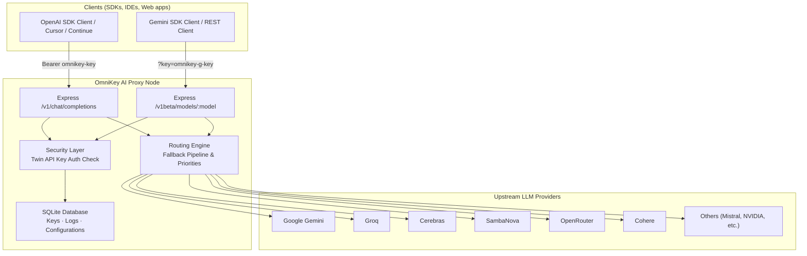
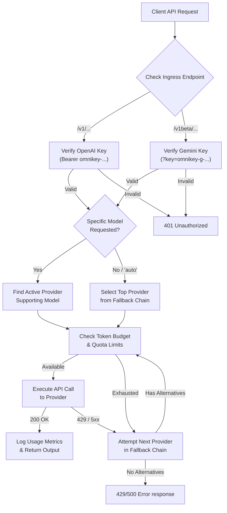

<p align="center">
  
</p>
<h1 align="center">OmniKey AI: Unified Key Manager</h1>
<p align="center">
  <strong>One OpenAI-compatible endpoint. Twelve free LLM providers. ~1B+ tokens per month.</strong><br/>
  <em>One bearer token → speak to 60+ models offline or online — OmniKey AI routes, falls over, and tracks budget transparently</em>
</p>

<p align="center">
  
  
  
  
  
  
</p>

---

## 📋 Table of Contents

- [Overview](#-overview)
- [Why OmniKey AI?](#-why-omnikey-ai)
- [Features](#-features)
- [Architecture](#-architecture)
- [Pipeline Flow](#-pipeline-flow)
- [Quick Start](#-quick-start)
- [Project Structure](#-project-structure)
- [Dependencies](#-dependencies)
- [Configuration](#-configuration)
- [Roadmap](#-roadmap)
- [Author](#-author)

---

## 🔍 Overview

**OmniKey AI** is a self-hosted, multi-format API gateway proxy that wraps 12 free-tier LLM providers—Gemini, OpenRouter, Cerebras, Groq, Mistral, GitHub Models, SambaNova, Cohere, Cloudflare, Z.ai (Zhipu), HuggingFace, and NVIDIA—into a unified environment. 

The proxy serves two endpoints natively:
* **OpenAI-Compatible Endpoint (`/v1`)**: Point OpenAI SDKs or clients at `/v1/chat/completions` using your unified OpenAI key (`omnikey-` prefix).
* **Gemini-Compatible Endpoint (`/v1beta`)**: Point Gemini SDKs or REST clients at `/v1beta/models/:model` (supporting `generateContent` and `streamGenerateContent` methods) using your unified Gemini key (`omnikey-g-` prefix).

Behind the scenes, OmniKey AI handles key storage (encrypted using AES-256-GCM), key duplication protection, rate limits, model routing, fallback cascades, and local telemetry logging of daily/monthly token counts.

---

## 🎯 Why OmniKey AI?

> **Most developers want access to a variety of models but don't want to pay high costs or manage multiple API keys. OmniKey AI handles this complexity for you.**

| Feature | Manual Multi-Provider Integration | OmniKey AI |
|---|---|---|
| **API Endpoints** | A dozen different URLs and payload formats | Dual `/v1` (OpenAI format) & `/v1beta` (Gemini format) |
| **API Keys** | 12 separate keys to rotate, secure, and manage | Twin unified keys (`omnikey-` / `omnikey-g-`) stored securely |
| **Failover** | Manual retry logic; app crashes when provider is down | Automatic fallback to backup providers in milliseconds |
| **Rate-Limits (429)** | Request fails immediately | Transparent retry across next best provider |
| **Usage Tracking** | Custom logging per platform to track free caps | Automatic local tracking of daily/monthly token usage |
| **Privacy** | Credentials stored in plain-text `.env` files | AES-256-GCM envelope encryption in local SQLite |
| **Visuals** | CLI-only or no interface | Modern React-based dashboard with models explorer & playground |

---

## ✨ Features

### 🔑 Key & Database Management
| Feature | Description |
|---|---|
| **AES-256-GCM Encryption** | Stored provider API credentials are encrypted at rest using local envelope encryption. |
| **Twin Unified Keys** | Offers both `omnikey-` (OpenAI format) and `omnikey-g-` (Gemini format) master keys. |
| **Duplicate Protection** | Automatically checks for and blocks duplicate API keys during manual input or CSV imports. |
| **Database Mode Switcher** | Toggles dynamically between Local-First SQLite and Cloud MongoDB contexts from the client login screen (saved in localStorage). |

### 🚀 Dynamic Routing & Fallback
| Feature | Description |
|---|---|
| **Virtual "auto" Model** | Requests to `auto` automatically route to the highest priority active provider. |
| **Automatic Fallback** | Cascades down a customizable pipeline when encountering 429 or 500 errors. |
| **Intelligent Re-routing** | Dynamically skips exhausted keys without caller awareness. |
| **Multi-Tenant Token Routing** | Automatically routes requests to Cloud MongoDB or SQLite databases dynamically by inspecting API key prefixes. |

### 📊 Real-Time Dashboard & Admin Console
| Feature | Description |
|---|---|
| **Models Catalog Explorer** | Complete page listing 100+ models with sorting, search, column configurators, availability checks, and item count summaries. |
| **Usage Gauges** | Clean visuals illustrating token budgets and daily/monthly stats. |
| **Playground & Sandbox** | Premium playground with format toggle (OpenAI vs. Gemini) alongside Dev Corner JS compiler and terminal console. |
| **Admin Console** | Secure page (`/admin`) presenting stats on total users, active key distribution, and overall savings (in Rupees ₹). |
| **Model Routing Controls** | Enable or disable individual models globally in real-time from the models panel. |
| **Audit Logs & Security** | View live proxy request trails with mapped developer emails, flush log history, and securely rotate admin credentials (secured with HMAC-SHA256). |
| **UI Polish & Themes** | Persistent support for light/dark mode theme toggles and a header shortcut button to quickly toggle database contexts. Uses custom themed Confirmation Modals instead of native alerts. |

---

## 🏗 Architecture



<details>
<summary>ASCII fallback (click to expand)</summary>

```
┌────────────────────────────────────────────────────────────────────────┐
│                        Clients (SDKs / IDEs)                           │
│              │                                        │                │
│              ▼ Bearer omnikey-key                     ▼ ?key=omnikey-g-│
├────────────────────────────────────────────────────────────────────────┤
│                       OmniKey AI Proxy                                 │
│                                                                        │
│  ┌───────────────────────────┐        ┌─────────────────────────────┐  │
│  │   Express /v1 Endpoint    │◄──────►│    Security & Auth          │  │
│  │   Completions Router      │        │    AES-256-GCM validation   │  │
│  └───────────┬───────────────┘        └──────────────┬──────────────┘  │
│              │                                       │                 │
│              ▼                                       ▼                 │
│  ┌───────────────────────────┐        ┌─────────────────────────────┐  │
│  │   Express /v1beta Ingress │◄──────►│    SQLite/MongoDB database  │  │
│  │   Gemini Compat Router    │        │    Keys, Logs, Stats        │  │
│  └───────────┬───────────────┘        └──────────────┬──────────────┘  │
│              │                                                         │
│              ▼                                                         │
│  ┌───────────────────────────┐                                         │
│  │   Routing Engine          │                                         │
│  │   Fallback Pipeline       │                                         │
│  └───────────┬───────────────┘                                         │
└──────────────┼─────────────────────────────────────────────────────────┘
               │
               ├──► Google Gemini
               ├──► Groq / Cerebras / SambaNova
               ├──► OpenRouter / Cohere
               └──► Others (Cloudflare, Mistral, NVIDIA...)
```

</details>

---

## 🔄 Pipeline Flow



<details>
<summary>ASCII fallback (click to expand)</summary>

```
Client API Request
     │
     ▼
Identify Endpoint Shape (/v1 OpenAI vs /v1beta Gemini)
     │
     ▼
Validate Associated Key (omnikey- in Header OR omnikey-g- in Query)
     │
     ├─► [Invalid Credentials] ──► 401 Unauthorized
     ▼
     [Valid Credentials]
     │
     ▼
Identify Target Model (Specific or "auto")
     │
     ▼
Select Best Available Provider (using Fallback Chain priorities)
     │
     ├─► [Budget Exhausted] ──► Cascade to next provider
     ▼
     [Quota Available]
     │
     ▼
Submit Request to Upstream Provider (Translated payload layout)
     │
     ├─► [429 / 5xx Error] ────► Try next provider in fallback pipeline
     ▼
     [200 Success Response]
     │
     ▼
Translate response layout, log token usage, & return JSON to client
```

</details>

---

## 🚀 Quick Start

### Prerequisites
- Node.js 20+
- npm (or yarn / pnpm)
- SQLite3

### Install & Run

```bash
# 1. Clone the repository
git clone https://github.com/Felix-au/OmniKey-AI-Unified-Key-Manager.git
cd OmniKey-AI-Unified-Key-Manager

# 2. Install dependencies
npm install

# 3. Create environment file and generate encryption key
cp .env.example .env
node -e "console.log('ENCRYPTION_KEY=' + require('crypto').randomBytes(32).toString('hex'))" >> .env

# 4. Run database migrations and seed models
# (automatically handled at server startup)

# 5. Start server and client together in development mode
npm run dev
```

---

## 📁 Project Structure

```
OmniKey-AI-Unified-Key-Manager/
├── package.json         # Workspace orchestrator
├── .gitignore          # Repository ignores
├── README.md           # This file
├── LICENSE             # MIT License
├── client/             # Frontend Dashboard (Vite + React + TS)
│   ├── src/
│   │   ├── App.tsx     # Main dashboard interface
│   │   └── index.css   # Main styles
│   └── index.html
├── server/             # Express API (Node.js + TS)
│   ├── src/
│   │   ├── db/         # SQLite schema initialization and seed
│   │   ├── providers/  # Upstream integration adapters
│   │   ├── routes/     # Proxy and keys API router
│   │   ├── services/   # Routing engine and limit enforcement
│   │   └── index.ts    # Application entry point
│   └── data/           # Database directory (gitignored)
└── shared/             # Shared Types & Schemas
    └── src/types.ts    # Model interfaces & platforms
```

---

## 📚 Dependencies

| Module | Purpose |
|---|---|
| `express` | Web server framework for the completions proxy and dashboard API |
| `sqlite3` | SQLite database driver for local keys and statistics |
| `dotenv` | Environment configuration manager |
| `cors` | Cross-Origin Resource Sharing middleware |
| `concurrently` | Development runner for concurrent client/server dev servers |
| `vitest` | Unit testing and proxy route simulation |
| `react` & `vite` | Client interface stack |

---

## ⚙️ Configuration

All configuration is loaded from the environment variables in your `.env` file:

| Environment Variable | Default | Description |
|---|---|---|
| `PORT` | `3001` | Express server port for incoming client API requests |
| `ENCRYPTION_KEY` | *(Required)* | 32-byte hex key used to encrypt and decrypt provider keys |
| `DATABASE_URL` | `./server/data/OmniKeyAI.db` | Absolute or relative path to SQLite database file |
| `MONGODB_URI` | *(Optional)* | Cloud database cluster address for multi-tenant deployment mode |
| `FIREBASE_PROJECT_ID` | *(Optional)* | Firebase gateway configuration ID for multi-tenant authentication |
| `VITE_API_URL` | *(Optional)* | Custom backend endpoint url for frontend client routing |

> [!NOTE]
> `LOCAL_DB_ENABLED` is deprecated. Selecting Local or Cloud database mode is handled directly on the frontend dashboard login UI. Uptime pinger cron-jobs are supported via the public `/api/cron-health` endpoint. Default admin credentials (`admin` / `admin`) are seeded automatically on startup if empty.

---

## 🗺️ Roadmap

- [ ] **Multi-Key Allocation**: Support adding multiple keys per provider and auto-balancing between them.
- [ ] **Streaming Fallbacks**: Re-route stream connections mid-generation if the socket drops.
- [ ] **Advanced Usage Graphs**: Detailed usage graphs by provider, model, and client token source.
- [ ] **Desktop Tray Minimization**: Packaging server as a system-tray background daemon.

---

## 👤 Author

**Felix-au** (Harshit Soni)

- 🔗 GitHub: [github.com/Felix-au](https://github.com/Felix-au)
- 📧 Email: [harshit.soni.23cse@bmu.edu.in](mailto:harshit.soni.23cse@bmu.edu.in)

---

<p align="center">
  <sub>Built for developers who want a single, smart API key for a billion free LLM tokens.</sub>
</p>
